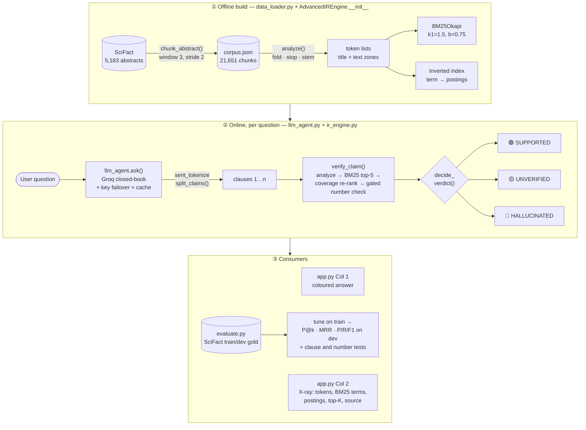
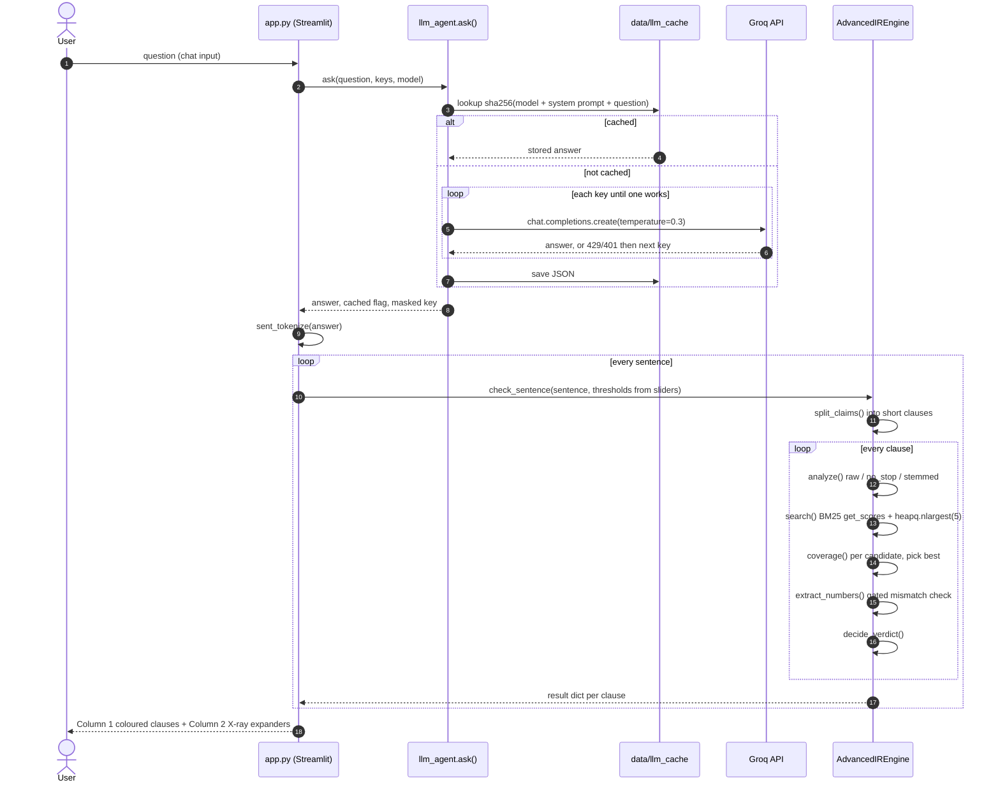
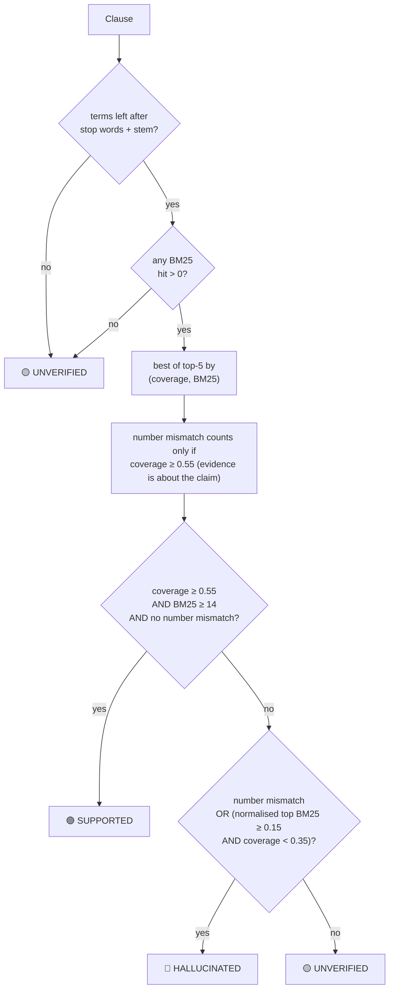
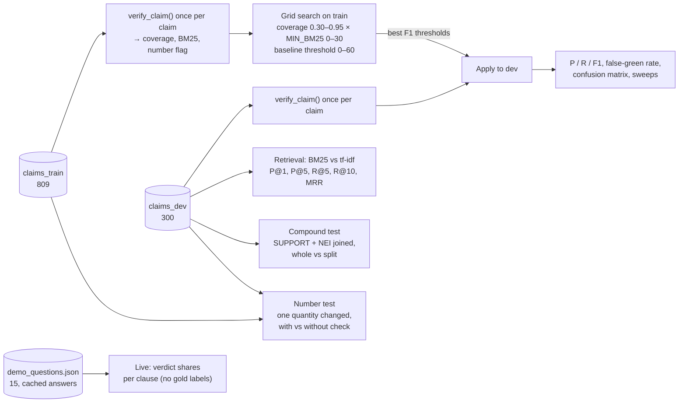
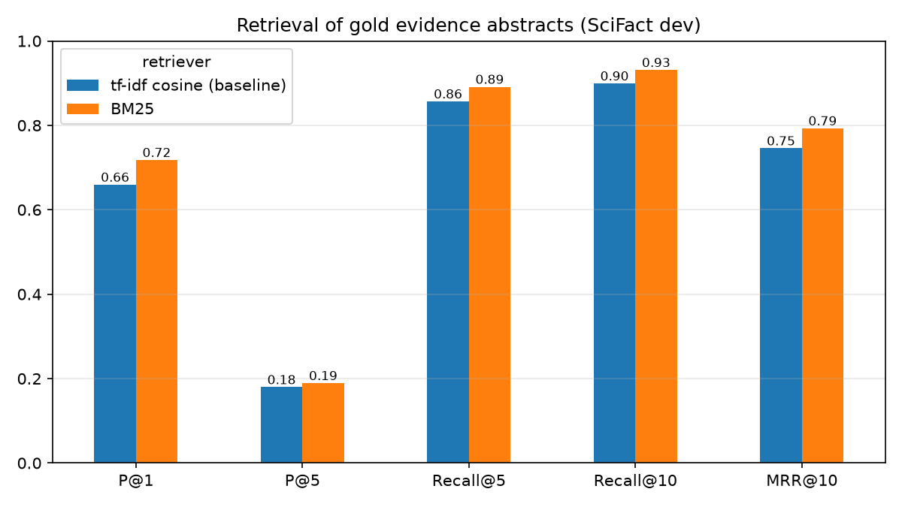
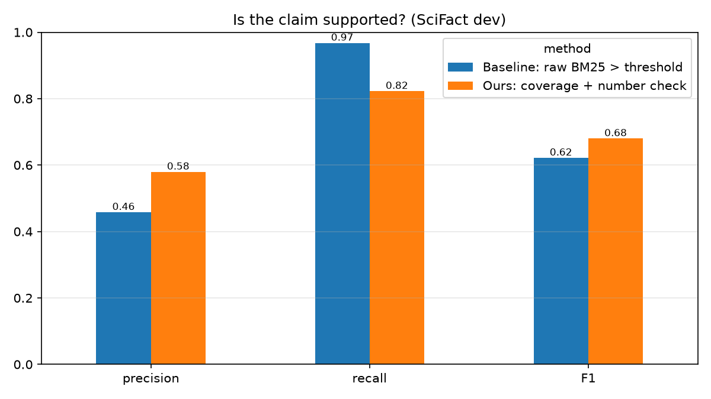
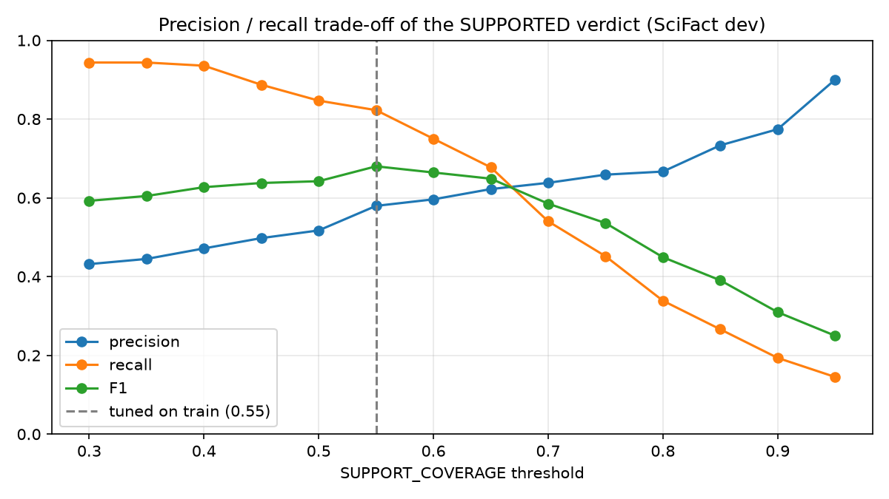
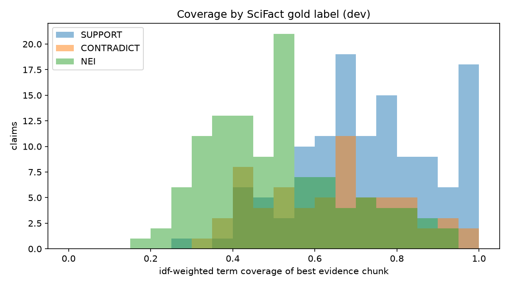

# Fact-Check RAG: The Hallucination Catcher — Technical Report

**Course:** CSD358 Information Retrieval · **Hackathon track:** T1 — Retrieval-Augmented Generation and trustworthy answers
**Corpus:** SciFact (5,183 scientific abstracts → 21,651 chunks) · **LLM:** Groq-hosted `openai/gpt-oss-120b` (closed-book)
**Code:** `midproject/factcheck_rag/` (~900 lines of Python across 5 modules)

---

## Table of contents

1. [Problem and motivation](#1-problem-and-motivation)
2. [System architecture](#2-system-architecture)
3. [Libraries and what they do in IR terms](#3-libraries-and-what-they-do-in-ir-terms)
4. [Module 1 — Corpus and chunking (`data_loader.py`)](#4-module-1--corpus-and-chunking-data_loaderpy)
5. [Module 2 — Text processing pipeline (`ir_engine.analyze`)](#5-module-2--text-processing-pipeline-ir_engineanalyze)
6. [Module 3 — Indexing: inverted index and BM25](#6-module-3--indexing-inverted-index-and-bm25)
7. [Module 4 — Retrieval: BM25 ranking, heap top-K, tf-idf baseline](#7-module-4--retrieval-bm25-ranking-heap-top-k-tf-idf-baseline)
8. [Module 5 — Claim verification](#8-module-5--claim-verification)
9. [Module 6 — LLM agent (`llm_agent.py`)](#9-module-6--llm-agent-llm_agentpy)
10. [Module 7 — X-Ray Dashboard (`app.py`)](#10-module-7--x-ray-dashboard-apppy)
11. [Evaluation methodology and results](#11-evaluation-methodology-and-results)
12. [Worked examples](#12-worked-examples)
13. [Complexity and performance](#13-complexity-and-performance)
14. [Limitations and future work](#14-limitations-and-future-work)
15. [Reproducing the results](#15-reproducing-the-results)
16. [References](#16-references)

---

## 1. Problem and motivation

Large language models answer fluently even when they are wrong. In science and health, a confident
sentence such as *"vitamin D supplementation reduced cancer mortality by 75%"* is dangerous if no study
says so. The Track 1 brief asks for a system *"where every generated claim can be traced to a ranked
source"* and where the retriever is *"a real IR component that you can inspect"*.

**What we built.** The LLM answers a question from memory (closed-book). The answer is split into
sentences, long sentences are split into short clauses, and **each clause becomes a query** against a
BM25 index of peer-reviewed abstracts. For every clause the system returns:

- a **verdict**: 🟢 SUPPORTED · 🟡 UNVERIFIED · 🔴 HALLUCINATED
- the **ranked source chunk** that best supports it (paper title + SciFact doc id)
- a full **IR X-ray**: processed tokens, per-term BM25 weights, postings lists, top-K candidates,
  idf-weighted coverage and the claim terms missing from the evidence

**Key design insight.** *Topical relevance is not factual support.* A high BM25 score only means the
chunk is *about* the same topic. "Vitamin D cures cancer" scores highly against any abstract about
vitamin D and cancer. So we separate **retrieval** (BM25 finds candidates) from **verification**
(idf-weighted term coverage + a number check decide whether the candidate actually contains the claim).
The evaluation shows this two-stage design beats a raw "BM25 score > threshold" baseline (Section 11).

---

## 2. System architecture

### 2.1 Component view



### 2.2 Request flow for one question



### 2.3 Module map

| File | Role | Key functions / classes | IR concepts |
|---|---|---|---|
| `data_loader.py` | Download SciFact, chunk abstracts | `download_scifact`, `chunk_abstract`, `build_corpus` | What is a document, chunking, zones |
| `ir_engine.py` | Index, retrieve, verify | `analyze`, `normalize_text`, `split_claims`, `AdvancedIREngine`, `search`, `search_tfidf`, `coverage`, `term_breakdown`, `verify_claim`, `check_sentence`, `decide_verdict` | Tokenisation, case-folding, stop words, stemming, inverted index, idf, BM25, heap top-K, VSM/cosine, two-stage ranking |
| `llm_agent.py` | Groq LLM call with multi-key failover and disk cache | `ask`, `load_keys`, `mask` | (generation side) |
| `app.py` | Streamlit X-Ray Dashboard | `load_engine`, `render_answer`, `render_xray`, `EXAMPLES`, `PASTE_EXAMPLES` | Shows postings, weights and scores |
| `evaluate.py` | Metrics, threshold tuning, targeted tests, charts | `evaluate_retrieval`, `claim_features`, `tune`, `evaluate_verifier`, `red_zone_sweep`, `coverage_sweep`, `evaluate_compound`, `evaluate_number_check`, `evaluate_live` | Precision, recall, F1, P@k, Recall@k, MRR |

Every syllabus touchpoint in the code carries an `# IR Concept:` comment (`grep -n "IR Concept" *.py`).

---

## 3. Libraries and what they do in IR terms

| Library | Used in | What it does in our pipeline |
|---|---|---|
| **rank-bm25** (`BM25Okapi`) | `ir_engine.py` | Stores per-chunk term frequencies (`doc_freqs`), chunk lengths (`doc_len`), `avgdl` and per-term `idf`, and computes BM25 scores for a query against every chunk. We read its internals to build the postings view and the per-term score table. |
| **NLTK** | `ir_engine.py`, `app.py`, `evaluate.py` | `PorterStemmer` (stemming), English stop-word list, `sent_tokenize` (Punkt sentence splitter, which turns the LLM answer into claim-sized queries). |
| **scikit-learn** | `ir_engine.py` | `TfidfVectorizer(sublinear_tf=True, norm="l2")` builds log-tf × idf vectors with length normalisation for the **tf-idf cosine baseline**. `linear_kernel` takes dot products, which equal cosines on L2-normalised vectors. |
| **NumPy / pandas** | throughout | Score arrays, result tables, metric aggregation, CSV export. |
| **matplotlib** | `evaluate.py` | Bar charts, the precision/recall sweep and the coverage histogram for the report. |
| **openai** (client only) | `llm_agent.py` | Groq exposes an OpenAI-compatible API, so the `OpenAI` client is pointed at `https://api.groq.com/openai/v1`. |
| **python-dotenv** | `llm_agent.py`, `app.py` | Loads `GROQ_API_KEYS` (one or more keys) / `LLM_MODEL` from the project's `.env`. |
| **Streamlit** | `app.py` | The two-column X-Ray Dashboard; `st.cache_resource` builds the index once per server process. |
| **requests** | `data_loader.py` | Downloads the SciFact release tarball. |

---

## 4. Module 1 — Corpus and chunking (`data_loader.py`)

### 4.1 Dataset

**SciFact** (Wadden et al., EMNLP 2020) contains:

| File | Contents | Our use |
|---|---|---|
| `corpus.jsonl` | 5,183 abstracts: `doc_id`, `title`, `abstract` (already a list of sentences) | The document collection |
| `claims_train.jsonl` | 809 expert-written claims with gold evidence | Threshold tuning |
| `claims_dev.jsonl` | 300 claims with gold evidence | Held-out reporting |

Each labelled claim looks like this:

```json
{"id": 5, "claim": "1/2000 in UK have abnormal PrP positivity.",
 "evidence": {"13734012": [{"sentences": [4], "label": "SUPPORT"}]},
 "cited_doc_ids": [13734012]}
```

A claim with an empty `evidence` is *NOT ENOUGH INFO* (NEI). Labels are `SUPPORT` or `CONTRADICT`.

### 4.2 Chunking algorithm — deciding "what is a document"

The unit we retrieve has to match the unit we verify: one LLM sentence.

| Option | Problem |
|---|---|
| Whole abstract (~10 sentences) | Too coarse: coverage gets inflated because some term from the claim appears *somewhere* in a long abstract |
| Single sentence | Too fine: loses context. A claim often spans two adjacent sentences |
| **Sliding window, 3 sentences, stride 2** ✅ | Small enough to be specific; the 1-sentence overlap means a fact that straddles a boundary is always fully inside some chunk |

```python
WINDOW = 3
STRIDE = 2

def chunk_abstract(doc):
    """Split one SciFact abstract (already a list of sentences) into overlapping windows."""
    sentences = [s.strip() for s in doc["abstract"] if s.strip()]
    chunks = []
    start = 0
    while True:
        window = sentences[start:start + WINDOW]
        if not window:
            break
        chunks.append({
            "chunk_id": f"{doc['doc_id']}_{start}",
            "doc_id": doc["doc_id"],
            "title": doc["title"].strip(),          # zone kept separately
            "text": " ".join(window),
            "sent_ids": list(range(start, start + len(window))),
        })
        if start + WINDOW >= len(sentences):
            break
        start += STRIDE
    return chunks
```

For an abstract with sentences `s0 … s6` this produces windows `[s0 s1 s2]`, `[s2 s3 s4]`, `[s4 s5 s6]`.
`chunk_id = "<doc_id>_<start sentence>"` and `sent_ids` map every chunk back to SciFact's gold rationale
sentences.

**Result:** 5,183 abstracts → **21,651 chunks**, 1,209,058 indexed tokens, average chunk length 55.8 terms,
vocabulary of 28,385 stemmed terms.

---

## 5. Module 2 — Text processing pipeline (`ir_engine.analyze`)

The **same** pipeline runs on chunks (at index time) and on claim sentences (at query time). If they
differed, query terms would never match index terms.

```python
_TOKEN_RE = re.compile(r"[a-z0-9]+(?:\.[0-9]+)?")

def _stopwords():
    # NLTK lists contraction fragments ("d" from "I'd", "t" from "don't") as stop words,
    # but in biomedical text they are content: "vitamin D", "T cells", "protein S".
    return set(stopwords.words("english")) - {"d", "t", "s", "m", "o", "y"}

@lru_cache(maxsize=200_000)
def _stem(word):
    return _STEMMER.stem(word)

def analyze(text):
    folded = text.lower().replace(",", "")                 # case-folding; "1,000" -> "1000"
    raw = _TOKEN_RE.findall(folded)                        # tokenisation
    no_stop = [t for t in raw if t not in _stopwords()]    # stop-word removal
    stemmed = [_stem(t) for t in no_stop]                  # Porter stemming
    return {"raw": raw, "no_stop": no_stop, "stemmed": stemmed}
```

| Step | Algorithm | Design decision |
|---|---|---|
| Case-folding | `str.lower()` | "BRCA1" = "brca1". Acronyms carry no case-specific meaning here. |
| Tokenisation | Regex `[a-z0-9]+(?:\.[0-9]+)?` | Keeps decimals ("2.5") as one token. Splits hyphens so "covid-19" ≡ "covid 19". Strips punctuation. |
| Stop-word removal | NLTK English list (198 words) **minus single letters d, t, s, m, o, y** | The stock list deletes the "D" in "vitamin D" and the "T" in "T cells". We found this while testing and removed those letters. |
| Stemming | Porter (1980) suffix-stripping, 5 rule phases | Conflates "infections / infected / infect" → `infect`. Memoised with `lru_cache` because the same word recurs millions of times when the corpus is indexed. |

**Example** (real output):

```
Input:     "Vitamin D deficiency is associated with an increased risk of tuberculosis."
raw:       vitamin d deficiency is associated with an increased risk of tuberculosis
no_stop:   vitamin d deficiency associated increased risk tuberculosis
stemmed:   vitamin d defici associ increas risk tuberculosi
```

`analyze()` returns all three stages so the dashboard can show each one.

---

## 6. Module 3 — Indexing: inverted index and BM25

### 6.1 Index construction

```python
class AdvancedIREngine:
    def __init__(self, corpus_path=CORPUS_PATH):
        with open(corpus_path, encoding="utf-8") as f:
            self.chunks = json.load(f)

        # Zones: title and body are both indexed
        self.chunk_tokens = [tokenize(c["title"] + " " + c["text"]) for c in self.chunks]
        self.chunk_token_sets = [set(toks) for toks in self.chunk_tokens]

        # BM25 (Okapi)
        self.bm25 = BM25Okapi(self.chunk_tokens, k1=1.5, b=0.75)

        # Inverted index: term -> postings list of chunk ids (sorted)
        self.postings_index = defaultdict(list)
        for chunk_idx, freqs in enumerate(self.bm25.doc_freqs):
            for term in freqs:
                self.postings_index[term].append(chunk_idx)

        self.max_idf = max(self.bm25.idf.values())
```

- **Zones.** Each chunk is indexed as `title + text`. A paper's subject is often named only in its
  title (*"…PPM1D mutations in brainstem gliomas"*). Without the title zone, a chunk from the middle of the
  abstract could never match a claim that names the subject. The title is also kept separately so the
  UI can display it as the source.
- **Inverted index.** `BM25Okapi.doc_freqs[i]` is a `{term: tf}` dict per chunk, i.e. a forward index.
  We invert it into `term → [chunk ids]`. Because chunks are visited in order, each postings list is
  **sorted by chunk id**, the standard layout that makes postings intersection possible. The dashboard prints
  these lists, e.g. `ppm1d df=8 -> ['5956380_0', …]`.
- **Document frequency.** `df(t) = len(postings(t))`.

### 6.2 idf

`rank_bm25` uses the Robertson–Spärck Jones (probabilistic) idf:

$$\mathrm{idf}(t) = \ln\frac{N - \mathrm{df}(t) + 0.5}{\mathrm{df}(t) + 0.5}$$

with $N = 21{,}651$ chunks. A term in more than half the chunks would get a negative idf; the library floors
those at $\varepsilon \cdot \overline{\mathrm{idf}}$ with $\varepsilon = 0.25$.

Check by hand: `ppm1d` appears in 8 chunks →
$\ln\frac{21651 - 8 + 0.5}{8 + 0.5} = \ln 2546.3 = 7.842$, which is exactly the value the X-ray reports.

```python
def idf(self, term):
    return self.bm25.idf.get(term, self.max_idf)
```

**Out-of-vocabulary terms** get `max_idf` (9.577). A word that never appears in the corpus, such as
"alien", is maximally specific, so failing to find it should count heavily against a claim.

### 6.3 BM25 scoring function

$$\mathrm{BM25}(q, d) = \sum_{t \in q} \mathrm{idf}(t)\cdot\frac{\mathrm{tf}_{t,d}\,(k_1 + 1)}{\mathrm{tf}_{t,d} + k_1\left(1 - b + b\,\frac{|d|}{\mathrm{avgdl}}\right)}$$

| Parameter | Value | Meaning |
|---|---|---|
| $k_1$ | 1.5 | **tf saturation**: the 4th occurrence of a term adds far less than the 1st (unlike raw tf) |
| $b$ | 0.75 | **length normalisation**: a long chunk is penalised because it matches terms by chance |
| avgdl | 55.84 | average chunk length in terms |

BM25 is outside the syllabus (it builds on the probabilistic relevance framework). Compared with tf-idf, the
saturation and length terms explain why it wins on SciFact (Section 11.2).

The dashboard recomputes each term's contribution with exactly this formula, so students can check a
score by hand:

```python
def term_breakdown(self, query_terms, chunk_idx):
    freqs = self.bm25.doc_freqs[chunk_idx]
    dl = self.bm25.doc_len[chunk_idx]
    k1, b, avgdl = self.bm25.k1, self.bm25.b, self.bm25.avgdl
    rows = []
    for term in dict.fromkeys(query_terms):  # unique, order kept
        tf = freqs.get(term, 0)
        idf = self.bm25.idf.get(term, 0.0)
        score = idf * tf * (k1 + 1) / (tf + k1 * (1 - b + b * dl / avgdl)) if tf else 0.0
        rows.append({"term": term, "tf": tf, "df": len(self.postings(term)),
                     "idf": round(idf, 3), "bm25": round(score, 3)})
    return rows
```

---

## 7. Module 4 — Retrieval: BM25 ranking, heap top-K, tf-idf baseline

### 7.1 BM25 search with heap-based top-K

```python
def search(self, query, k=TOP_K):
    terms = tokenize(query) if isinstance(query, str) else query
    if not terms:
        return []
    scores = self.bm25.get_scores(terms)                       # one score per chunk
    top = heapq.nlargest(k, range(len(scores)), key=scores.__getitem__)
    return [(i, float(scores[i])) for i in top if scores[i] > 0]
```

`heapq.nlargest` keeps a size-K min-heap while scanning N scores: **O(N log K)** instead of O(N log N)
for a full sort. With N = 21,651 and K = 5 that is the textbook "heap-based top-K selection".
Zero-score chunks share no term with the query and are dropped.

### 7.2 Baseline: tf-idf vector space model with cosine similarity

```python
def search_tfidf(self, query, k=TOP_K):
    if self._tfidf is None:
        self._tfidf = TfidfVectorizer(analyzer=lambda toks: toks, sublinear_tf=True, norm="l2")
        self._tfidf_matrix = self._tfidf.fit_transform(self.chunk_tokens)
    terms = tokenize(query) if isinstance(query, str) else query
    if not terms:
        return []
    q_vec = self._tfidf.transform([terms])
    sims = linear_kernel(q_vec, self._tfidf_matrix).ravel()
    top = heapq.nlargest(k, range(len(sims)), key=sims.__getitem__)
    return [(i, float(sims[i])) for i in top if sims[i] > 0]
```

- `analyzer=lambda toks: toks` makes sklearn reuse **our** tokens, so the only difference from BM25 is the
  weighting scheme (a controlled comparison).
- `sublinear_tf=True` → $1 + \log \mathrm{tf}$ (log-frequency weighting). sklearn idf is
  $\ln\frac{1+N}{1+\mathrm{df}} + 1$. `norm="l2"` → cosine normalisation, close to SMART **ltc** on both sides.
- On unit vectors, $\cos(\vec q, \vec d) = \vec q \cdot \vec d$, so `linear_kernel` (a sparse
  dot product) gives the cosine directly.

---

## 8. Module 5 — Claim verification

### 8.1 Why a raw BM25 threshold is not enough

BM25 measures **aboutness**, not **support**:

1. Scores are unnormalised: longer sentences produce larger sums, so a single threshold means different
   things for different sentences.
2. Topical overlap dominates: "Vitamin D supplementation reduced cancer mortality by 75%" matches abstracts
   about vitamin D and cancer whether or not any of them reports 75%.

On SciFact dev, the raw-BM25 baseline marks **79.5% of NOT-ENOUGH-INFO claims green** (Section 11.3).

### 8.2 Two-stage ranking: retrieve with BM25, re-rank by coverage

**Stage 1:** BM25 returns the top K = 5 chunks.
**Stage 2:** each candidate is re-scored by **idf-weighted term coverage**: the share of the claim's
informational weight that actually appears in the chunk.

$$\mathrm{coverage}(c, d) = \frac{\sum_{t \in T_c \cap T_d} \mathrm{idf}(t)}{\sum_{t \in T_c} \mathrm{idf}(t)}$$

where $T_c$ is the set of distinct processed terms of the claim and $T_d$ those of the chunk.

Why idf-weighted? Missing the word "patients" (idf ≈ 1.5) barely matters; missing "PPM1D" (idf 7.8) or an
unseen word like "alien" (idf 9.6) means the chunk is not talking about the same thing. Coverage is in
$[0, 1]$, so unlike BM25 one threshold means the same for every claim.

```python
def coverage(self, query_terms, chunk_idx):
    terms = set(query_terms)
    if not terms:
        return 0.0, []
    chunk_terms = self.chunk_token_sets[chunk_idx]
    total = sum(self.idf(t) for t in terms)
    covered = sum(self.idf(t) for t in terms if t in chunk_terms)
    missing = sorted((t for t in terms if t not in chunk_terms), key=self.idf, reverse=True)
    return (covered / total if total > 0 else 0.0), missing
```

The `missing` list, sorted by idf, is shown in red in the X-ray as **"Not found in evidence"**. It
explains *why* a sentence failed.

### 8.3 Number-mismatch check

Fabricated statistics are a common hallucination pattern. Numbers are normalised (`"1,000"→"1000"`,
`"2.50"→"2.5"`) and compared as sets:

```python
claim_nums = extract_numbers(sentence)
chunk_nums = extract_numbers(chunk["title"] + " " + chunk["text"])
number_mismatch = bool(claim_nums and chunk_nums and not claim_nums <= chunk_nums)
```

Mismatch fires only if **the claim states a number, the evidence states numbers, and the claim's numbers
are not a subset of the evidence's**. If the evidence contains no numbers, the claim is not contradicted,
merely not confirmed. Coverage handles that case, because numbers are also index terms.

Two refinements came out of testing on real LLM answers:

- **Number normalisation.** Models write "20 000", "20,000" or "20\u202f000". These are one number, but the
  original tokeniser read "20" and "000". `normalize_text()` applies Unicode NFKC and joins thousands
  groups before tokenising and before extracting numbers.
- **The check is gated on coverage.** Figures can only *contradict* evidence that is about the same
  claim. A mismatch counts only when the best chunk already covers the claim at least as much as a
  SUPPORTED verdict needs (`NUMBER_GATE_COVERAGE = 0.55`). Without the gate, a clause quoting ten statistics
  was flagged red against any on-topic chunk, because ten numbers are never all in an unrelated chunk.

### 8.4 Verdict rule



```python
def decide_verdict(coverage, best_bm25, norm_top, number_mismatch,
                   support_cov=SUPPORT_COVERAGE, halluc_cov=HALLUCINATION_COVERAGE, min_bm25=MIN_BM25,
                   min_norm=MIN_NORM_BM25):
    if coverage >= support_cov and best_bm25 >= min_bm25 and not number_mismatch:
        return "SUPPORTED"
    if number_mismatch or (norm_top >= min_norm and coverage < halluc_cov):
        return "HALLUCINATED"
    return "UNVERIFIED"
```

The three-way split matters. A closed-book LLM states many **true** facts that a 5,183-abstract corpus
simply doesn't cover. Calling those "hallucinations" would be wrong, so:

- **UNVERIFIED (amber):** the corpus is off-topic or only partly matches, so we can't judge.
- **HALLUCINATED (red):** the corpus *does* discuss the topic (length-normalised top BM25 ≥
  `MIN_NORM_BM25`) but the specifics are absent or the figures differ. The clause adds something the
  retrieved sources never said.

**Why "on topic" uses a normalised score.** Raw BM25 is a sum over query terms, so it grows with query
length. The first version tested `top BM25 ≥ 14`, which worked on 10-term SciFact claims but called
unrelated chunks "on topic" for 20-term LLM clauses (for example, "Akkermansia … BMI" matched a paper on
*Bmi-1 in cervical cancer*). We now divide by the most the query could score, $(k_1+1)\sum_t \mathrm{idf}(t)$
(every term at tf → ∞). The median normalised top score is 0.34 on SciFact claims but 0.19 on the LLM
clauses, which confirms the length effect.

### 8.5 Thresholds

All thresholds are module-level constants at the top of `ir_engine.py` and can be changed live from the
dashboard sliders:

```python
THRESHOLD = 18.0              # raw-BM25 baseline
MIN_BM25 = 14.0               # minimum BM25 to be "on topic"
SUPPORT_COVERAGE = 0.55       # coverage needed for SUPPORTED
HALLUCINATION_COVERAGE = 0.35 # on-topic but coverage below this -> HALLUCINATED
MIN_NORM_BM25 = 0.15          # "on topic" = top BM25 / (sum(idf) * (k1+1)) at least this
NUMBER_GATE_COVERAGE = 0.55   # number mismatch only counts if the evidence covers this much
TOP_K = 5                     # BM25 candidates re-checked for coverage
SPLIT_ABOVE_TERMS = 12        # sentences longer than this are split into clauses
CLAUSE_MIN_TERMS = 4          # shorter fragments are merged into a neighbour
```

`THRESHOLD`, `MIN_BM25` and `SUPPORT_COVERAGE` were **grid-searched on SciFact `claims_train`** to
maximise F1 (Section 11.1). `HALLUCINATION_COVERAGE` only splits red from amber and has no gold label,
so it was set by inspection. `MIN_NORM_BM25` = 0.15 is the **largest value that keeps at least 80% of red
verdicts truly unsupported on train** (0.83 there; at 0.20 it falls to 0.74); the sweep is in
`outputs/red_zone_sweep.csv`. `NUMBER_GATE_COVERAGE` is set equal to `SUPPORT_COVERAGE` by reasoning,
not tuned: it only moves claims between red and amber, so it cannot change the SUPPORTED F1.

### 8.6 `verify_claim` — the full per-claim routine

```python
def verify_claim(self, sentence, support_cov=None, halluc_cov=None, min_bm25=None, threshold=None,
                 number_gate=None, min_norm=None):
    stages = analyze(sentence)
    terms = stages["stemmed"]
    result = {...defaults: verdict "UNVERIFIED", score 0 ...}
    hits = self.search(terms, TOP_K)                                  # stage 1: BM25 top-K
    if not hits:
        return result

    candidates = []
    for rank, (idx, bm25_score) in enumerate(hits, start=1):          # stage 2: coverage
        cov, missing = self.coverage(terms, idx)
        candidates.append({"idx": idx, "rank": rank, "bm25": bm25_score,
                           "coverage": cov, "missing": missing})
    best = max(candidates, key=lambda c: (c["coverage"], c["bm25"]))
    chunk = self.chunks[best["idx"]]

    claim_nums = extract_numbers(sentence)                            # number check
    chunk_nums = extract_numbers(chunk["title"] + " " + chunk["text"])
    number_mismatch_raw = bool(claim_nums and chunk_nums and not claim_nums <= chunk_nums)
    number_mismatch = number_mismatch_raw and best["coverage"] >= number_gate      # gated

    top_score = hits[0][1]
    max_possible = (self.bm25.k1 + 1) * sum(self.idf(t) for t in set(terms))
    norm_top = top_score / max_possible                                # length-normalised BM25
    verdict = decide_verdict(best["coverage"], best["bm25"], norm_top, number_mismatch,
                             support_cov, halluc_cov, min_bm25, min_norm)
    result.update({...})
    return result
```

**Returned dictionary** (the four fields from the original spec come first):

| Key | Type | Meaning |
|---|---|---|
| `score` | float | BM25 score of the selected evidence chunk |
| `source_chunk` | str | Text of the selected evidence chunk |
| `tokens_matched` | list | Processed (stemmed) query terms |
| `is_supported` | bool | `verdict == "SUPPORTED"` |
| `verdict` | str | SUPPORTED / UNVERIFIED / HALLUCINATED |
| `coverage` | float | idf-weighted coverage of the evidence chunk |
| `unsupported_terms` | list | Claim terms missing from the evidence, highest idf first |
| `number_mismatch`, `number_mismatch_raw`, `claim_numbers` | bool, bool, list | Gated and ungated number check, and the claim's numbers |
| `top_score`, `norm_top` | float | BM25 score of the rank-1 chunk, and its length-normalised value |
| `bm25_only_supported` | bool | What the raw-BM25 baseline would say |
| `tokens_raw`, `tokens_no_stop` | list | Intermediate pipeline stages |
| `term_breakdown` | list[dict] | Per-term tf, df, idf, BM25 contribution |
| `top_k` | list[dict] | All 5 candidates with BM25 rank, score, coverage |
| `doc_id`, `title`, `chunk_rank` | — | Provenance of the evidence |

### 8.7 Splitting long sentences into claims (`split_claims`)

SciFact claims average about 10 distinct terms, and the thresholds were tuned on that scale. LLM sentences
average about 22. **Coverage is a share of the query's terms**, so a long sentence can almost never be
covered by one 3-sentence chunk even when every fact in it is true. This is the query-side twin of the
chunking decision in Section 4.2: both sides of the match need a sensible "unit".

`split_claims()` is rule-based and deliberately small:

```python
_STAT_PAREN_RE = re.compile(r"\s*[\(\[][^()\[\]]*\d[^()\[\]]*[\)\]]")   # "(HR 0.88, 95% CI ...)"
_CLAUSE_BOUNDARY_RE = re.compile(
    r"\s*;\s*|\s*[\u2014\u2013]\s+|\s*:\s+"
    r"|,\s+(?:but|while|whereas|although|though|yet|and|which|thereby|suggesting|indicating)\s+"
    r"|\s+(?:but|whereas|although)\s+", re.I)

def split_claims(sentence):
    if len(set(tokenize(sentence))) <= SPLIT_ABOVE_TERMS:
        return [{"text": sentence.strip(), "dropped": []}]       # short claims pass through untouched
    dropped = [m.strip() for m in _STAT_PAREN_RE.findall(sentence)]
    text = _STAT_PAREN_RE.sub("", sentence).strip()               # statistics in parentheses set aside
    clauses = []
    for piece in _CLAUSE_BOUNDARY_RE.split(text):
        piece = (piece or "").strip(" ,.;:")
        if piece and clauses and len(set(tokenize(piece))) < CLAUSE_MIN_TERMS:
            clauses[-1] += ", " + piece                           # fragment: glue to previous clause
        elif piece:
            clauses.append(piece)
    ...
```

Example (real model output):

```
In the large VITAL trial (20 000 adults, 2 000 IU/day for 5 years) the supplement lowered total cancer
mortality by 13 % (hazard ratio 0.88, 95 % CI 0.78–0.99) but did not significantly change overall cancer incidence.
   →  clause 1: "In the large VITAL trial the supplement lowered total cancer mortality by 13 %."
      clause 2: "did not significantly change overall cancer incidence."
      set aside: (20 000 adults, 2 000 IU/day for 5 years)  (hazard ratio 0.88, 95 % CI 0.78–0.99)
```

Short sentences are returned unchanged, so **splitting does not alter any SciFact result**. The dashboard
colours and explains each clause separately (`AdvancedIREngine.check_sentence`).

---

## 9. Module 6 — LLM agent (`llm_agent.py`)

```python
GROQ_BASE_URL = "https://api.groq.com/openai/v1"
DEFAULT_MODEL = os.getenv("LLM_MODEL", "openai/gpt-oss-120b")

def ask(question, api_key=None, model=None, use_cache=True):
    model = model or DEFAULT_MODEL
    path = _cache_path(model, question)              # sha256(model + system prompt + question)
    if use_cache and os.path.exists(path):
        with open(path, encoding="utf-8") as f:
            return json.load(f)["answer"], True

    keys = load_keys(api_key)            # sidebar keys, then GROQ_API_KEYS, then GROQ_API_KEY
    start = _last_good % len(keys)       # start from the key that worked last time
    for key in keys[start:] + keys[:start]:
        client = OpenAI(api_key=key, base_url=GROQ_BASE_URL, max_retries=0)
        try:
            response = client.chat.completions.create(
                model=model,
                messages=[{"role": "system", "content": SYSTEM_PROMPT},
                          {"role": "user", "content": question}],
                temperature=0.3,
            )
        except (RateLimitError, AuthenticationError, PermissionDeniedError):
            continue                     # rate-limited / invalid key -> fail over to the next
        _last_good = keys.index(key)
        break
    else:
        raise RuntimeError("All Groq keys failed — ...")
    ...  # write {model, question, answer} to data/llm_cache/<hash>.json
```

| Decision | Reason |
|---|---|
| **Closed-book** (no retrieved context in the prompt) | We are testing what the model asserts *from memory*, which is where hallucinations come from. |
| System prompt asks for 4–6 factual sentences with specific findings and figures | Gives the verifier concrete, checkable claims instead of vague prose. |
| `temperature=0.3` | Mostly deterministic answers, so demos are repeatable. |
| **Disk cache** keyed by `sha256(model + system prompt + question)` | Reproducible evaluation, no free-tier rate-limit failures during the video, zero cost on re-runs. A changed prompt or model automatically gets a new cache entry. |
| **Multiple keys with failover** (`GROQ_API_KEYS=k1,k2,…` and/or the sidebar's password field) | Free-tier keys have per-minute limits. On HTTP 429, 401 or 403 the next key is tried, and later calls start from the last working key. Keys are shown masked (`gsk_…9f3a`) so a screen recording never reveals them. |
| `.env` loaded **only from the project folder** | `load_dotenv()` by default walks up parent directories; during testing it picked up an unrelated `.env` from a parent folder. |

---

## 10. Module 7 — X-Ray Dashboard (`app.py`)

Layout: `st.set_page_config(layout="wide")` with two equal columns.

| Area | Content |
|---|---|
| Sidebar | Answer source (Ask Groq / Paste text), extra API keys (password field, comma-separated) + count of available keys, model name, cache toggle, four threshold sliders (SUPPORTED coverage and BM25; HALLUCINATED coverage and normalised BM25) |
| Column 1 — user side | **Ask mode:** chat input + example question pills (`EXAMPLES`). **Paste mode:** text box + one-click examples with known SciFact answers (`PASTE_EXAMPLES`: correct claim, real vs changed figure, compound sentence, off-corpus, two deliberate limitations). Then: raw LLM answer → **fact-checked paragraph** (each clause wrapped in a coloured `<span>`) → counts per verdict |
| Column 2 — IR X-ray | One expander per checked clause: metrics (evidence BM25, top-1 BM25 and its normalised value, coverage, evidence rank), statistics set aside by the clause splitter, tokens at each pipeline stage, missing terms, number mismatch warning, per-term BM25 table, source chunk with title + doc id, top-K table, postings lists |

Essential pieces:

```python
@st.cache_resource(show_spinner="Building BM25 index over SciFact chunks…")
def load_engine():
    ensure_nltk()
    return AdvancedIREngine()          # built once per server process (~3 s)
```

```python
sentences = [s for s in sent_tokenize(run["answer"]) if s.strip()]
results = [engine.verify_claim(s, support_cov=support_cov, halluc_cov=halluc_cov, min_bm25=min_bm25)
           for s in sentences]
```

```python
def render_answer(results):
    parts = []
    for i, r in enumerate(results, start=1):
        _, bg, border = VERDICT_STYLE[r["verdict"]]
        tip = f'S{i} · {r["verdict"]} · BM25 {r["score"]} · coverage {r["coverage"]}'
        parts.append(f'<span class="claim" style="background:{bg};border-color:{border}" '
                     f'title="{html.escape(tip)}">{html.escape(r["sentence"])}</span>')
    st.markdown(f'<div class="answer-box">{" ".join(parts)}</div>', unsafe_allow_html=True)
```

All LLM text is passed through `html.escape` before going into HTML. **Paste mode** verifies any text
without an API key, which is useful for testing edge cases such as negation.

---

## 11. Evaluation methodology and results

All numbers below are produced by `python evaluate.py` (≈ 1 minute) and saved to `outputs/`.
**No LLM is inside the evaluation loop.** The SciFact claims themselves are the queries, so results
are deterministic.

### 11.1 Protocol



- **Tuning on train, reporting on dev** avoids fitting thresholds to the data we report on.
- Features are computed once per claim. The grid search then re-applies only `decide_verdict`, so
  tuning is cheap.

```python
def tune(train):
    gold = train.gold == "SUPPORT"
    best_base = max(((t, prf(train.top_score > t, gold)[2]) for t in range(0, 61)), key=lambda x: x[1])
    best_ours = (None, None, -1.0)
    for cov in [x / 100 for x in range(30, 96, 5)]:
        for mb in range(0, 31, 2):
            f = prf(ours_pred(train, cov, mb) == "SUPPORTED", gold)[2]
            if f > best_ours[2]:
                best_ours = (cov, mb, f)
    return best_base[0], best_ours[0], best_ours[1]
```

Tuned values: baseline `THRESHOLD = 18`; ours `SUPPORT_COVERAGE = 0.55`, `MIN_BM25 = 14`.

### 11.2 Retrieval quality

**Task:** given a dev claim, rank abstracts; relevant = SciFact gold evidence abstracts (188 claims that
have evidence). Chunk rankings are collapsed to abstract rankings (first occurrence wins).

| Metric | Definition |
|---|---|
| P@k | (relevant abstracts in top k) / k |
| Recall@k | (relevant abstracts in top k) / (all relevant abstracts) |
| MRR@10 | mean of 1 / rank of the first relevant abstract (0 if none in top 10) |

| Retriever | P@1 | P@5 | Recall@5 | Recall@10 | MRR@10 |
|---|---|---|---|---|---|
| tf-idf cosine (baseline) | 0.660 | 0.180 | 0.857 | 0.899 | 0.746 |
| **BM25** | **0.718** | **0.189** | **0.891** | **0.931** | **0.793** |

BM25 wins on every metric. P@1 improves by 5.8 points and MRR by 4.7. Both systems use identical tokens, so
the gain comes purely from tf saturation and length normalisation. P@5 is low for both by construction:
most claims have exactly one relevant abstract, so the maximum P@5 is 0.2.



### 11.3 Verifier quality

**Task:** predict whether a dev claim is SUPPORTED. Gold positive = SciFact label SUPPORT. Gold negatives =
CONTRADICT and NOT ENOUGH INFO.

| Method | Precision | Recall | F1 |
|---|---|---|---|
| Baseline: raw BM25 > threshold | 0.458 | 0.968 | 0.622 |
| **Ours: coverage + number check** | **0.580** | 0.823 | **0.680** |

The baseline calls almost everything supported (recall 0.97, precision 0.46). Our verifier trades a little
recall for a large precision gain.

**False-green rate** (share of non-supported claims shown green; lower is better):

| Gold label | n | Baseline | Ours |
|---|---|---|---|
| NOT ENOUGH INFO | 112 | 79.5% | **30.4%** |
| CONTRADICT | 64 | 82.8% | 62.5% |

**Confusion matrix (ours, dev):**

| gold \ predicted | 🟢 SUPPORTED | 🟡 UNVERIFIED | 🔴 HALLUCINATED |
|---|---|---|---|
| SUPPORT (124) | 102 | 16 | 6 |
| CONTRADICT (64) | 40 | 22 | 2 |
| NEI (112) | 34 | 61 | 17 |

Of the 25 red verdicts on dev, 19 (76%) are claims SciFact does not label SUPPORT. Contradictions remain the weak spot: they share almost all their terms with the evidence (see Section 14).



### 11.4 Operating-point sweep

Moving `SUPPORT_COVERAGE` trades recall for precision. The train-tuned value (0.55) is also the dev F1
maximum, which suggests the tuning generalises:

| SUPPORT_COVERAGE | 0.40 | 0.50 | **0.55** | 0.60 | 0.65 | 0.70 | 0.80 | 0.90 |
|---|---|---|---|---|---|---|---|---|
| Precision | 0.472 | 0.517 | **0.580** | 0.596 | 0.622 | 0.638 | 0.667 | 0.774 |
| Recall | 0.935 | 0.847 | **0.823** | 0.750 | 0.677 | 0.540 | 0.339 | 0.194 |
| F1 | 0.627 | 0.642 | **0.680** | 0.664 | 0.649 | 0.585 | 0.449 | 0.310 |



The coverage distributions per gold label (`outputs/coverage_by_label.png`) show SUPPORT claims shifted
towards high coverage, but heavily overlapping CONTRADICT claims. That overlap is the quantitative signature
of the negation limitation.



### 11.5 Targeted tests for the two long-text fixes

Both fixes were motivated by real LLM output, but LLM sentences have no gold labels. So each is checked on
a **labelled synthetic test built from SciFact dev** (`outputs/compound_test.csv`,
`outputs/number_check_test.csv`).

**Clause splitting — does it rescue a true fact hidden in a long sentence?** We joined each of the 124
dev SUPPORT claims to a random NOT-ENOUGH-INFO claim (`"A; B"`, `"A, while B"`, `"A, but B"`). The first
part is true; the second is not backed by the corpus.

| Measure | Value |
|---|---|
| Compound sentences split into exactly 2 clauses | 87.1% |
| **True part shown green: whole sentence checked at once** | **8.1%** |
| **True part shown green: after splitting** | **81.5%** |
| True part shown green: checked alone (upper bound) | 82.3% |
| Unbacked part wrongly shown green: after splitting / alone | 30.6% / 29.8% |

Checking the long sentence as one query almost never succeeds (8.1%) even though half of it is true.
Splitting recovers essentially all of the single-claim performance (81.5% vs 82.3%) without adding false
greens.

**Number check — does it catch a changed quantity?** From train + dev SUPPORT claims that state a
*quantity* (a number followed by a unit: %, weeks, years, mg, fold, patients, $…) and are judged SUPPORTED,
we replaced that quantity with a wrong value ($3n+7$) and re-checked. Example: *"…quit smoking reduce lung
cancer risk by approximately 50%"* (🟢) → *"…by approximately 157%"* (🔴, same source paper).

| Measure (10 claims) | Value |
|---|---|
| Still green **without** the number check | 8 / 10 |
| Still green **with** the number check | **0 / 10** |
| Flagged red with the number check | 8 / 10 |

Term overlap alone cannot see a changed quantity, because the rest of the claim still matches. The check
removes all of those false greens here. **The sample is small**: SciFact has few claims with explicit
quantities. A first version of this test changed *any* digit and reported 35 claims, but many of those edits
changed names instead of statistics ("ALDH1" → "ALDH10", "Th17" → "Th58"). Those test entity matching, not
the number check, so we restricted the test to quantities.

### 11.6 Live LLM answers

`python evaluate.py --live` runs the 15 questions in `demo_questions.json` through Groq (cached after the
first run), splits every sentence into clauses and verifies each one. It writes
`outputs/live_answers.csv` (clause level). The earlier sentence-level run is kept in
`outputs/live_answers_sentence_level.csv`.

| | Sentence level (no splitting, ungated number check, raw BM25 on-topic test) | Clause level (current) |
|---|---|---|
| Units checked | 73 sentences | 97 clauses |
| 🔴 HALLUCINATED | 63 (86%) | 28 (29%) |
| 🟡 UNVERIFIED | 8 (11%) | 64 (66%) |
| 🟢 SUPPORTED | 2 (3%) | 5 (5%) |

**These shares are not a hallucination rate.** There are no gold labels for LLM text, and a manual look at
12 of the 28 remaining red clauses shows most are *real, well-known findings* (the Scandinavian Simvastatin
Survival Study, the Heart Protection Study) that simply are not among SciFact's 5,183 abstracts. Red on
general LLM text therefore mostly means "specifics not found in our corpus". The reliable evidence for the
verifier is the labelled SciFact evaluation (11.3) and the targeted tests (11.5). To measure real
hallucination on LLM text we would need a corpus that covers the questions asked (Section 14).

---

## 12. Worked examples

### 12.1 Correct support — SciFact dev claim

*"Activation of PPM1D suppresses p53 function."* (gold: SUPPORT)

```
stemmed query: activ  ppm1d  suppress  p53  function
verdict: SUPPORTED   BM25 28.511   coverage 1.00   evidence rank 1
source: "Exome sequencing identifies somatic gain-of-function PPM1D mutations in brainstem gliomas"

term       tf   df     idf     bm25
activ       2   4321   1.389    2.183
ppm1d       4      8   7.842   15.137   ← rare term dominates the score
suppress    1    686   3.419    3.919
p53         1    232   4.523    5.185
function    1   3019   1.820    2.086
                                ------
                                28.510
```

Evidence: *"…PPM1D mutations … attenuated p53 activation in vitro. … enhanced the ability of PPM1D to
suppress the activation of the DNA damage response checkpoint protein CHK2."* The per-term BM25 values add
up to the chunk score, so the ranking can be checked by hand.

### 12.2 Fabricated statistic — caught by the number check

*"Vitamin D supplementation reduced cancer mortality by 75% in the trial."*

```
verdict: HALLUCINATED   coverage 0.659   number_mismatch: True   claim_numbers: ['75']
not found in evidence: 75, trial, cancer
```

Coverage alone (0.66) would have passed the 0.55 threshold. The evidence chunk reports figures, but not 75,
so the sentence is flagged red.

### 12.3 Out-of-corpus nonsense

*"ISRO built a secret alien base on the moon."* → no chunk scores above `MIN_BM25`, so 🟡 **UNVERIFIED**.
The X-ray lists `isro, alien, secret, moon` as missing. The system correctly declines to judge rather
than claiming knowledge it doesn't have.

### 12.4 A false positive (limitation)

*"Vitamin D deficiency is associated with an increased risk of tuberculosis."*

```
verdict: SUPPORTED   BM25 26.922   coverage 0.717
not found in evidence: tuberculosi (idf 4.69), associ (idf 1.65)
```

The evidence chunk is about vitamin D deficiency and fracture risk; it never mentions tuberculosis. Five
matching terms (`vitamin`, `d`, `defici`, `increas`, `risk`) carry 72% of the idf mass, so the average passes,
even though the single most specific *missing* term is the subject of the claim. The X-ray makes this
visible: `tuberculosi` is listed first under "Not found in evidence". A stricter coverage setting, or a
rule on the highest-idf missing term, would catch it (Section 14). We tested such a rule on SciFact train
and it did not improve F1, so it was not adopted.

---

## 13. Complexity and performance

| Operation | Complexity | Measured (development laptop) |
|---|---|---|
| Corpus build (`data_loader.py`) | O(total sentences) | ~1.5 s (after the one-time download) |
| Index build (tokenise + BM25 + inverted index) | O(T), T = 1.2 M tokens | ~3 s (stemming memoised) |
| One BM25 query | O(\|q\| · N) with `rank_bm25` (scores every chunk) | ~13.5 ms |
| Heap top-K | O(N log K) | negligible |
| Coverage re-rank | O(K · \|q\|) set lookups | negligible |
| Full evaluation (`evaluate.py --live`: 1,109 claims × 2 retrievers, tuning, sweeps, targeted tests, cached live answers) | — | ~66 s |

`rank_bm25` scores every chunk for each term, i.e. it does not walk the postings lists. At 21K chunks this
is fast enough. At web scale we would score only chunks in the union of the query terms' postings
(term-at-a-time), and apply champion lists or index elimination of low-idf terms.

---

## 14. Limitations and future work

| Limitation | Evidence | Possible fix |
|---|---|---|
| **Negation / contradiction.** "X increases Y" vs "X does not increase Y" share almost every term, and "no"/"not" are NLTK stop words, so they are deleted before retrieval. Example: *"LDL cholesterol has no involvement in … cardiovascular disease"* is green (coverage 0.87), gold CONTRADICT | 62.5% of CONTRADICT claims shown green | Negation-cue features near matched terms; an entailment model (excluded from this build by design) |
| **Coverage is an average.** One missing high-idf subject term can be outweighed | Example 12.4 | A rule on the max-idf missing term, tuned on a larger set; proximity of matched terms (positional index) |
| **Paraphrase / synonymy.** Correct sentences worded differently get low coverage | 16 of 124 SUPPORT claims UNVERIFIED | Query expansion with synonyms (UMLS / MeSH); dense or hybrid retrieval |
| **Corpus scope.** True facts outside 5,183 abstracts | Amber verdicts, and 29% red on live answers that are mostly real but uncovered findings (Section 11.6) | Larger collection (PubMed abstracts, CORD-19); ask questions the corpus covers |
| **Rule-based clause splitting.** No parser, so some clauses are cut badly and statistics in parentheses are set aside, not checked | 87% of compound test sentences split into exactly 2 clauses | Dependency-parse or LLM-based atomic-claim extraction (FActScore-style) |
| **Number check is set-based.** "20%" vs "20 patients" are treated alike | — | Unit-aware number extraction |
| **Closed-book only.** The LLM never sees the evidence | By design | RAG generation mode: feed top-K chunks to the LLM with citation markers, then compare hallucination rates |

**Roadmap (course project):**
1. A positional index and a proximity feature (matched terms within a window).
2. A synonym/MeSH expansion layer.
3. Hybrid sparse + dense retrieval.
4. A RAG generation mode with closed-book vs grounded hallucination-rate comparison.
5. A larger hand-judged set of real LLM sentences.

---

### Demo example selection (disclosure)

The recorded demo (`docs/DEMO_GUIDE.md`) uses **selected** examples, and we state how:

- **Live LLM questions** were chosen for corpus coverage. We generated 12 candidate questions from
  SciFact's most frequent title topics, ran each through the LLM and checker, and show the ones the
  corpus can check. Even the best (DNA methylation) had 3 of 7 clauses green, 5 of 12 had none, and the
  median was 1. This is itself a finding: closed-book LLM answers are written at textbook level, and
  SciFact holds specific research results.
- **Paste-mode examples** are SciFact claims with gold labels, or controlled edits of them, so correctness
  is judged against ground truth. Two of them are deliberate failures (negation, averaging).
- **Not curated:** `demo_questions.json` (15 questions, fixed before tuning) and the SciFact dev metrics.

---

## 15. Reproducing the results

```bash
cd midproject/factcheck_rag
python3 -m venv .venv && source .venv/bin/activate
pip install -r requirements.txt
cp .env.example .env              # GROQ_API_KEYS=key1,key2 (free at console.groq.com/keys)

python data_loader.py             # → data/corpus.json (21,651 chunks)
python ir_engine.py               # smoke test: three example verdicts
python evaluate.py                # → outputs/*.csv, outputs/*.png  (deterministic)
python evaluate.py --live         # + Groq answers for demo_questions.json
streamlit run app.py              # X-Ray Dashboard (Paste mode works without a key)
```

| Output file | Contents |
|---|---|
| `outputs/retrieval_results.csv`, `retrieval.png` | Section 11.2 |
| `outputs/verifier_results.csv`, `verifier.png` | Section 11.3 |
| `outputs/verifier_false_green.csv`, `verifier_confusion.csv` | Section 11.3 tables |
| `outputs/verifier_sweep.csv`, `verifier_sweep.png` | Section 11.4 |
| `outputs/coverage_by_label.png` | Coverage histogram per gold label |
| `outputs/verifier_dev_predictions.csv` | Per-claim features and verdicts (error analysis) |
| `outputs/tuned_thresholds.json` | Thresholds chosen on train |

---

## 16. References

1. D. Wadden, S. Lin, K. Lo, L. L. Wang, M. van Zuylen, A. Cohan, H. Hajishirzi. *Fact or Fiction: Verifying
   Scientific Claims.* EMNLP 2020. (SciFact dataset)
2. S. Robertson, H. Zaragoza. *The Probabilistic Relevance Framework: BM25 and Beyond.* Foundations and
   Trends in IR, 2009.
3. C. D. Manning, P. Raghavan, H. Schütze. *Introduction to Information Retrieval.* Cambridge University
   Press, 2008. Ch. 1–2 (inverted index, tokenisation, stemming), Ch. 6–7 (tf-idf, VSM, top-K), Ch. 8 (evaluation).
4. M. F. Porter. *An algorithm for suffix stripping.* Program, 14(3), 1980.
5. P. Lewis et al. *Retrieval-Augmented Generation for Knowledge-Intensive NLP Tasks.* NeurIPS 2020.
6. N. Thakur et al. *BEIR: A Heterogeneous Benchmark for Zero-shot Evaluation of Information Retrieval
   Models.* NeurIPS Datasets & Benchmarks 2021.
7. Libraries: rank-bm25, NLTK, scikit-learn, Streamlit, OpenAI Python client (against Groq's
   OpenAI-compatible endpoint).

**AI-use declaration.** Claude Code (Anthropic) was used to design the system, write the code and draft this
document. The answers being fact-checked are generated by an LLM served through the Groq API.
